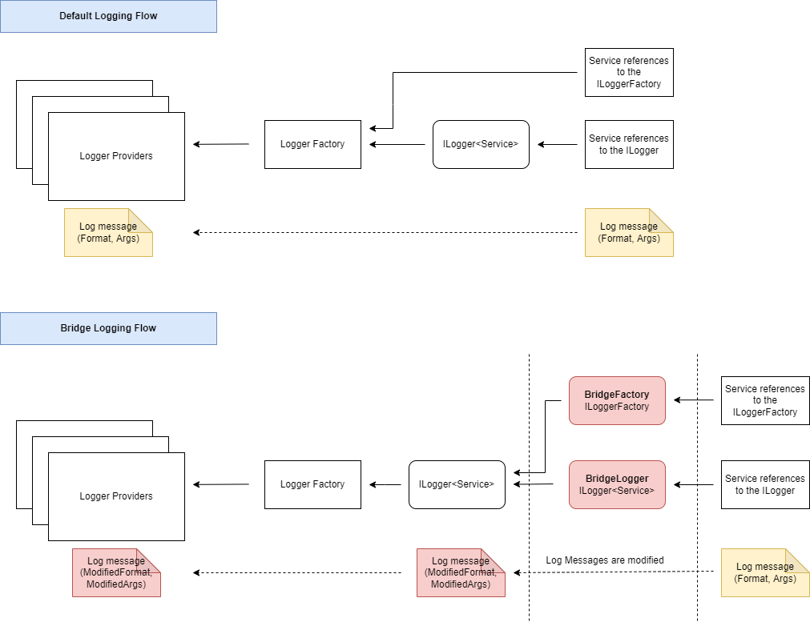

# BridgeLogger

This is a proof of concept of how to bridge an existing ILogger.

# Problem

Once I was given a library named `ExternalLibrary`, I had to add it as a service to the project implementing `Dependency Injection`.
The library has a contructor definition like below
```
class ExternalLibrary
{
    public ExternalLibrary(ILogger<ExternalLibrary> logger, ...);
}
```

All services in the project had to log with a pre-defined format below. All logs will be pushed to a Serilog's ElasticSearch sink. Any log does not follow the format, the log consumer will have an issue of parsing it later.
```
Log.LogInformation("{@ActionGroup} {@ActionTaken}", "GroupA", "ActionA");
Log.LogError("{@ActionGroup} {@ActionTaken}", "GroupA", "ActionA");
...
```

The problem came when I had to handle log messages from `ExternalLibrary` but log messages did not follow the pre-defined format. Here is how the log messages from `ExternalLibrary` were logged:
```
Log.LogInformation("Begin to fetching...");
Log.LogError("An error occured while ...");
...
```

# Solution

I created a bridge logger injected to `ExternalLibrary`, it accepted a delegate `CustomLogFormatter` so that it could modify the `format` as well as the `arguments` of all log messages going through it.

The definition of the delegate `CustomLogFormatter`:
```
(string, object[]) CustomLogFormatter(string originalFormat, List<object> originalArguments)
{
    // ...
    // Custom implementation
    // ...
    
    return (newFormat, newArguments);
}
```

The illustration below shows how the bridge logger worked.


# Next

- [ ] Create a benchmark showing how bad the performance affected by the bridge logger.
- [ ] Optimize the bridge implementation **or** find a different approach to solve the problem.
